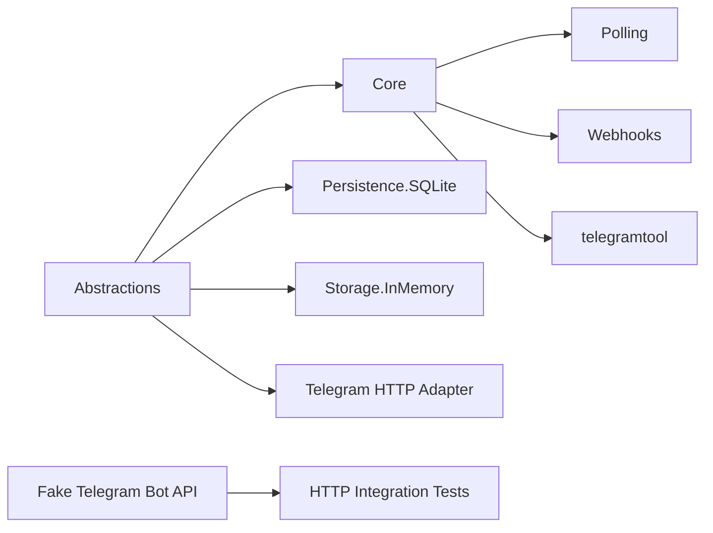

# Telegram Automation Framework

Production-oriented .NET 10 reference framework for Telegram bot automation with routing, middleware, long polling, webhooks, Fake Bot API, SQLite persistence, local scheduling, outbox, idempotency, observability, CLI, Docker and CI.


## Quick Start

```bash
dotnet restore
dotnet build TelegramAutomation.slnx -c Release
dotnet test TelegramAutomation.slnx -c Release
dotnet run --project src/TelegramAutomation.FakeTelegramApi
dotnet run --project src/TelegramAutomation.Cli -- doctor
```

No real Telegram token is required by default. Tests, samples and Docker use `TelegramAutomation.FakeTelegramApi`.

## Current Compatibility

- Telegram Bot API: 10.2, dated 2026-07-14.
- Telegram.Bot package: 22.10.2.1.
- Target framework: `net10.0`.

## Example

```csharp
var processor = new TelegramAutomationBuilder()
    .UseCommand("/start", StartHandler)
    .UseCallback("confirm:", ConfirmHandler)
    .UseText(TextHandler)
    .UseFallback(FallbackHandler)
    .Build();
```

## Architecture



Core does not reference `Telegram.Bot`; the Telegram adapter owns API transport. Fake API is isolated from production runtime and is used by tests, Docker and local samples.

## Validation Snapshot

Local validation on Windows with .NET SDK 10.0.110:

- Build Release: passed.
- Tests: 117 passing.
- Core module coverage gate: 85.04% line total.
- SQLite persistence coverage gate: 80.1% line total.
- NuGet vulnerable audit: no vulnerable packages.
- Docker compose build: passed.
- Docker health smoke: Fake API and WebhookHost returned healthy.
- CLI smoke: doctor, fake-api health, bot run-polling, bot run-webhook passed.

## CLI

```bash
dotnet run --project src/TelegramAutomation.Cli -- doctor
dotnet run --project src/TelegramAutomation.Cli -- fake-api health
dotnet run --project src/TelegramAutomation.Cli -- bot run-polling
dotnet run --project src/TelegramAutomation.Cli -- bot run-webhook
dotnet run --project src/TelegramAutomation.Cli -- updates replay
```

## Docker

```bash
docker compose config
docker compose build
docker compose up -d
```

Fake API health: `http://localhost:5080/health`.
WebhookHost health: `http://localhost:5090/health`.

## Security

The repo intentionally contains no real bot tokens, chat IDs, `.env`, logs or local databases. Use `.env.example` and environment variables for real bots. Token-shaped strings and Authorization headers are redacted by tests and CLI helpers.
